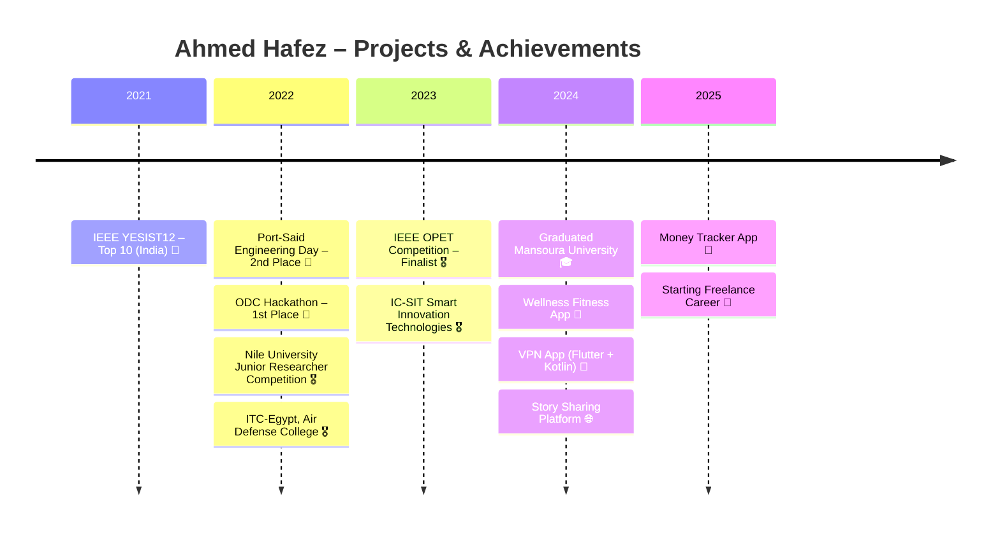

 
 
# 👨‍💻 Ahmed Hafez   
### Software Engineer | Mobile Developer (Flutter & Kotlin)   
 
💡 Building mobile apps with elegant design & seamless user experience.   
🎓 Computer Engineering, Mansoura University (2024).   
 

 
 
--- 
 
## ⚡ Skills & Tools   
 

 
   

 
 
--- 
 
## 🚀 Projects & Work   

📱 **Mobile Apps**   
- 🟢 Wellness Fitness App → Daily workouts, BMI tracker, API caching.   
- 🔵 Quiz App → Multiple Categories, Difficulty Levels, Question Types.
- 🟢 Meals App → Add Meal, Meal Details, Local Database.
- 🔵 News App → Top Headlines, Search Functionality, Multi-language Support.

🤖 **Robotics & Embedded Systems**   
- 🎓 **Graduation Project**: *Over-the-air updates for Advanced Driver Assistance Systems (ADAS)*  
  Based on **Embedded Systems, IoT, and AI techniques** to enable secure, reliable remote software updates.  

- 🚗 **Bluetooth-based Smart Phone Controlled Robot Car** *(Atmega32, C)*  
  Controlling and moving the car using a Bluetooth module.  

- 💻 **Virtual Terminal with USART** *(Atmega32, C)*  
  Communication between ATmega32 microcontroller and a laptop.  

- 🏥 **Multi-task Biomedical Robotic System** *(Atmega32, C)*  
  - Measured patient’s vital processes: heartbeat, blood-oxygen ratio, and temperature.  
  - Used **MLX90614** temperature sensor.  
  - Used **MAX30102** to measure blood oxygen.  
  - Integrated **ESP32CAM** for face recognition and patient monitoring.  

- 🤖 **Smart Robot Project** → Led hardware + software integration.   
- 🌐 **IoT Experiments** → Sensors, automation & embedded systems.   
 
 
--- 
 
## 🏆 Competitions & Achievements   
 
- 🥇 Orange Digital Center Hackathon (1st Place)   
- 🏅 IEEE YESIST12 – India (Top 10, 2021)   
- 🥈 Port-Said Engineering Day (2nd Place, 2022)   
- 🎖️ IEEE OPET Competition – UH (Finalist, 2023)   
- 🎖️ Nile University – Junior Researcher Competition (2022)   
- 🎖️ ITC-Egypt, Air Defense College (2022)   
 
--- 
 
## 📊 GitHub Insights   
 

 
   
   

 
 
--- 
 
## 🎓 Education   
 
- **Bachelor of Engineering (BEng), Computer Engineering**  
  Mansoura University, Egypt  
  *2019 – 2024*  
  - Grade: **B+ (Very Good with Honor Degree)**  
  - Ranked: **9th in the cohort**  
  - Total Average: **81.98%**
 
---  

## 🌐 Connect with Me  

 
   
   
   

  

---  

## 🐍 Contribution Snake  

  <!-- Light mode -->
  <picture>
    <source media="(prefers-color-scheme: dark)" srcset="https://raw.githubusercontent.com/AhmedHafez32/AhmedHafez32/output/github-contribution-grid-snake-dark.svg" />
    <source media="(prefers-color-scheme: light)" srcset="https://raw.githubusercontent.com/AhmedHafez32/AhmedHafez32/output/github-contribution-grid-snake.svg" />
    
  </picture>

---  
## 🛣️ Timeline  

---

✨ *“Code is like humor. When you have to explain it, it’s bad.”* ✨  

